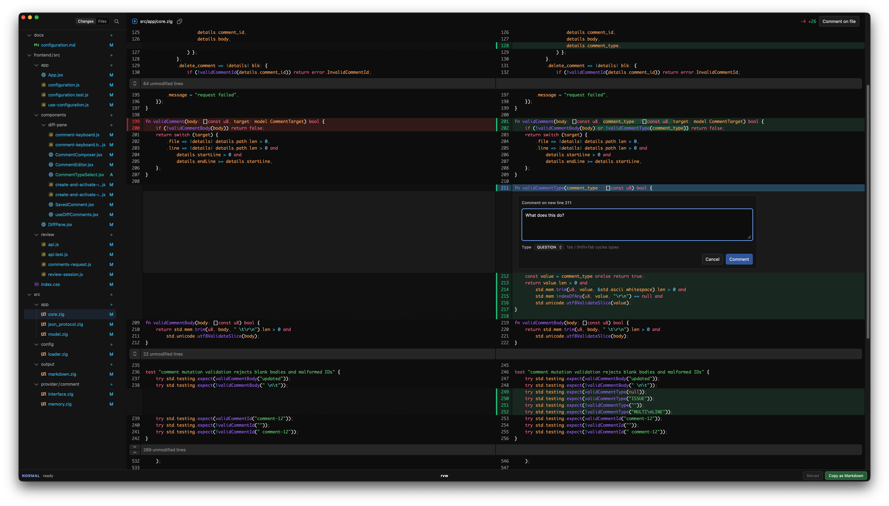

<h1 align="center">Rvw</h1>

  Rvw (Review) is a code review and annotation tool designed for fast iteration with AI agents during development

  

  <b><a href="#installation">Installation</a></b> | <b><a href="./docs">Documentation</a></b>

## Installation and Usage

## Acknowledgements

